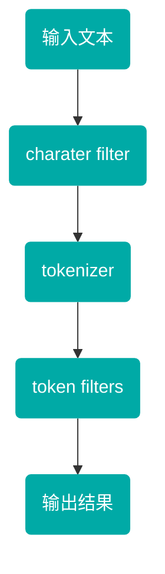

## 什么是分词器❓

> - 顾名思义，文本分析就是 **把全文本转换成一系列单词（term/token）的过程** ，也叫 **分词** 。在 ES 中，Analysis 是通过**分词器（Analyzer）** 来实现的，可使用 ES 内置的分析器或者按需定制化分析器。

### 分词器组成部分

> - 分词器是专门处理分词的组件，分词器由以下三部分组成：
>   1. character filter
>   2. tokenizer
>   3. token filters

#### charater filter

> - 对原字符进行过滤和处理，去除原字符中无效或异常的字符，例如：多余空格等

#### tokenizer

> - 将处理后的字符拆分为一个一个的词，在一个分词器中有且只有一个

#### token filters

> - 对分词结果进行过滤和处理，例如：将多个词合成一个。例如：一个苹果，分成了 [一个，苹果]，则可以通过此过程合成一个词，一个苹果。
> - 一个分词器中可能有多个

### 分词过程



### 分词优化

> 分词器的选择和配置对ES的性能和搜索效果具有重要影响。以下是一些分词优化的建议：
>
> 1. **选择合适的分词器** ：根据文本的语言、特点和需求，选择合适的分词器。对于不同的语言和场景，可能需要使用不同的分词器以达到最佳效果。
> 2. **定制分词规则** ：对于特定的领域或场景，可能需要定制分词规则以提高分词的准确性和效率。例如，可以添加自定义的词典、停用词列表等。
> 3. **避免过度分词** ：过度分词可能导致词元过多、冗余，影响搜索效果和性能。因此，在配置分词器时，应尽量避免过度分词。
> 4. **监控和调整分词效果** ：定期监控分词效果，根据实际需求调整分词器的配置和规则。

## 常用分词器

### 内置分词器

1. standard 标准分词器

> - 默认的分词器，分词器对中文不友好，中文分词时，会将每个字拆分
> - Standard是ES的默认分词器，具备**按词切分、支持多语言；小写处理**等特点。


2. simple分词器

> - 简单分词器有着按照非字母切分、小写处理的特点。
> - 如下图，分词结果会把非数字拆分，非数字相当于分隔符


3. whitespace 空格分词器

> - 顾名思义，会按照空格将文本进行拆分


### 中文分词器

> - 上述的分词都是基于英文来进行分词的，对于中文而言，并不能完全适用。中文分词是指将一个汉字序列切分成一个个单独的词，在英文中，单词之间是通过空格作为自然分隔符，汉字中没有一个形式上的分词符。
> - 同时，汉字中存在着一词多义，一词多性（可做动词也可做名词），比如："乒乓 / 球拍 / 卖完了" 和“乒乓球 / 拍卖 / 完了”。同样的一句话可以有多种分词方式，所以中文分词的难度较大，往往需要自己根据实际情况进行定义。常用的中文分词器有 `ik分词器` 和 `jieba`分词器。

> - 中文分词器包括 2 种，即 `ik_smart` 和 `ik_max_word`
> - ik 分词器中的简单分词器，支持自定义字典，远程字典
> - ik_分词器的全量分词器，支持自定义字典，远程字典

#### ik_smart

> - IK分词器可以实现中英文单词的切分，支持ik_smart、ik_maxword等模式，可以自定义词库和支持热更新分词词典。


## 分词器应用

### 测试分词器

- 接口：`http://<ip>:<port>/_analyze`
- 请求方式：`POST`
- 请求参数：
  ```json
  {
    "analyzer": "ik_smart",
    "text": "分词器测试文本"
  }

  ```
